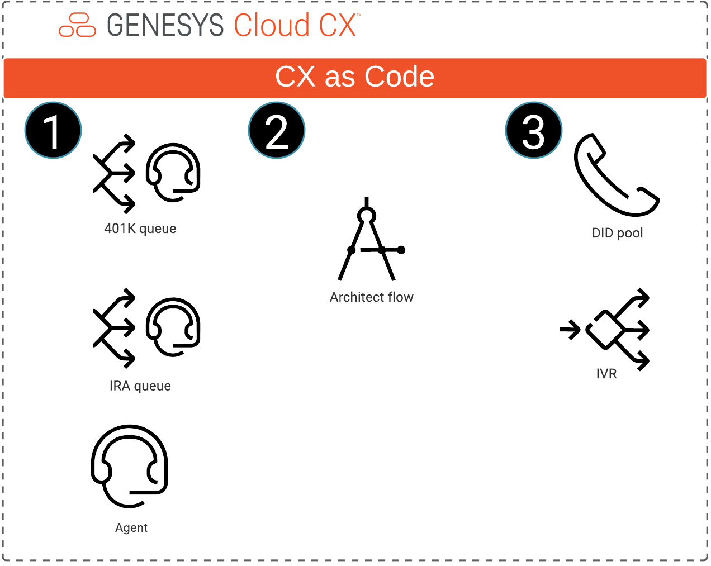

# Deploy a simple IVR using Terraform and CX as Code

> View the full [Deploy a simple IVR using Terraform and CX as Code](https://developer.mypurecloud.com/blueprints/) article on the Genesys Cloud Developer Center. This Genesys Cloud Developer Blueprint provides a simple example of how to deploy a touch-tone based IVR using Terraform and CX as Code.  

